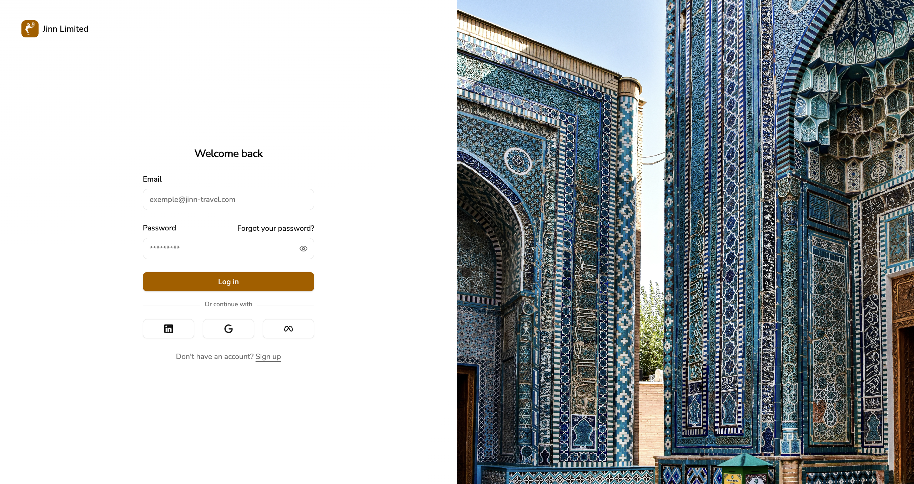
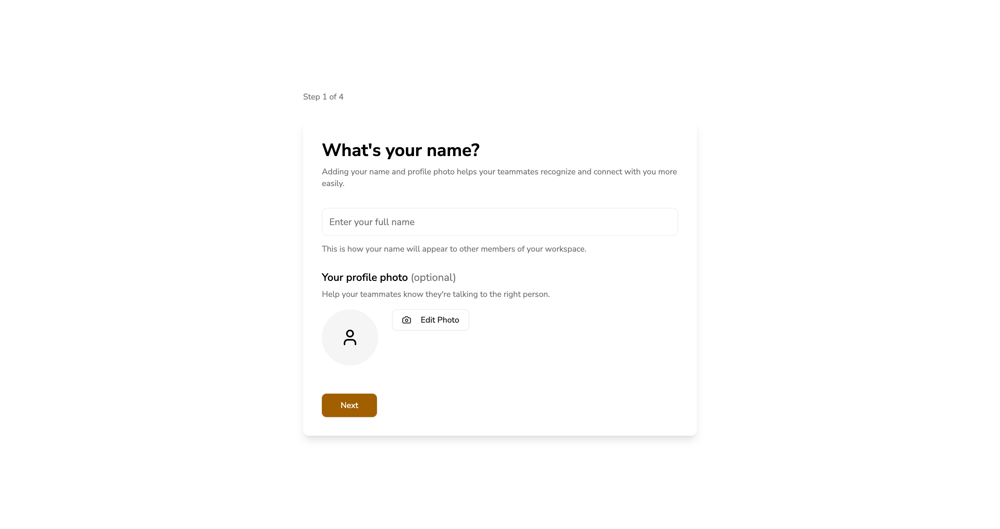
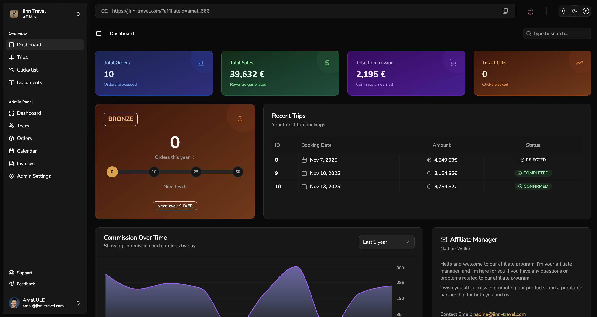
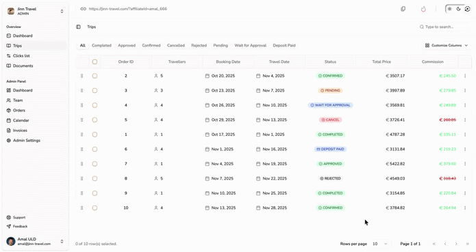
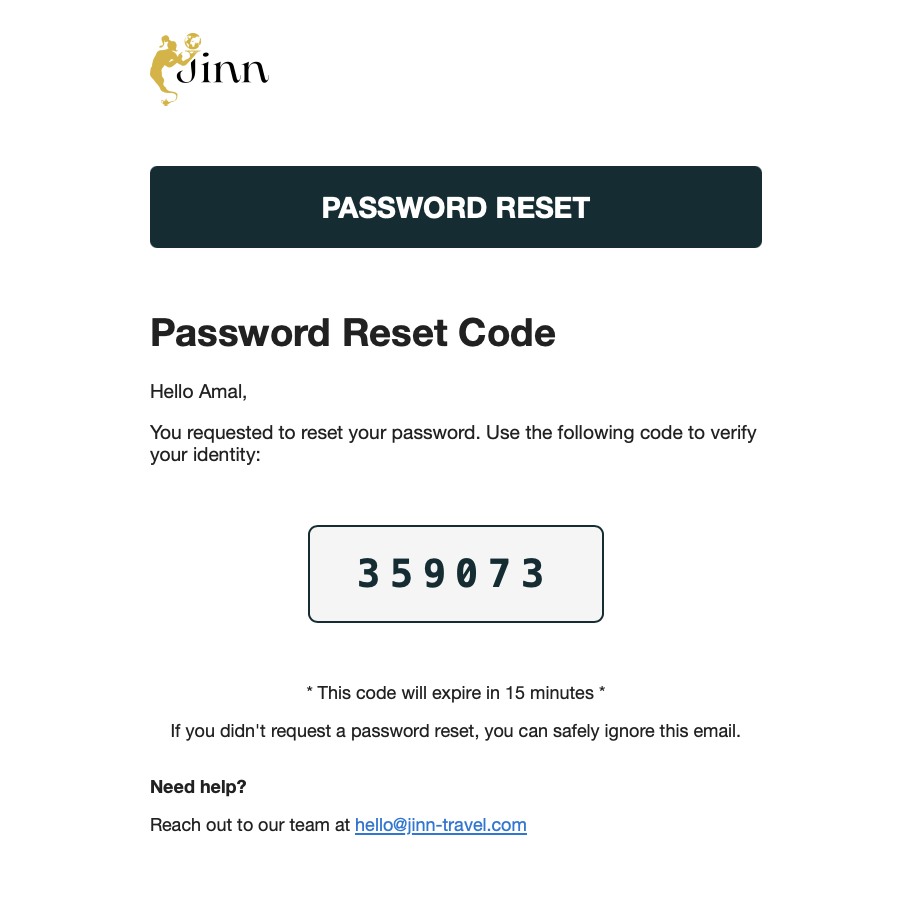

# Affiliate Platform

Multi-tenant affiliate marketing platform for the travel industry. Partners earn commissions through referral links and promo codes; admins manage teams, orders, and integrations with external booking systems.

## UI Preview

<p align="center">
  
  
</p>
<p align="center">
  
  
</p>
<p align="center">
  
</p>

---

## Features

### Authentication
- **Email/password** — classic sign-up and login
- **SSO via Clerk** — Google, LinkedIn, Facebook
- **Email verification** — OTP code
- **Password recovery** — reset link via email
- **Set password** — for users who signed up via OAuth

### Email & Notifications
- **OTP verification** — one-time codes sent to email for sign-up verification
- **Password reset** — secure reset links via email
- **Notifications** — transactional emails and system alerts

<p align="center">
  
</p>

### Partner (Affiliate)
- **Dashboard** — clicks, bookings, commissions, level progress
- **Referral links** — unique links and promo codes
- **Trips** — bookings made through referral links
- **Clicks list** — referral link analytics
- **Documents** — invoices and statements
- **Settings** — profile, avatar, security (change/add password)
- **Workspace switcher** — switch between tenants
- **Level system** — Bronze → Silver → Gold → Platinum (commission tiers)

### Admin
- **Team** — manage partners and their data
- **Orders** — all bookings across partners
- **Calendar** — booking calendar view
- **Invoices** — billing overview
- **Level settings** — configure tier thresholds per tenant
- **API keys** — manage keys for external integrations
- **Field mappings** — map incoming API fields to internal schema (for different booking system formats)

### API Integration
- **POST** `/api/integration/trips` — receive bookings from external systems (tour operators, CRMs)
- **Field mapping** — flexible mapping of incoming fields (`travel_date`, `client_name`, etc.) to internal schema
- **API key auth** — `X-API-Key` or `Authorization: Bearer`
- **Tenant isolation** — each API key is tied to a tenant

### Multi-Tenant
- **Path-based routing** — `/:tenantSlug/overview`, `/:tenantSlug/admin/...`
- **Workspace per tenant** — each company (travel agency) has its own workspace
- **Business sign-up** — create workspace and admin account
- **Data isolation** — tenants see only their own data

---

## Tech Stack

| Layer      | Stack                                      |
| ---------- | ------------------------------------------ |
| Frontend   | React 19, Vite, TypeScript, Tailwind, Radix UI, Redux Toolkit, React Query |
| Auth       | JWT, bcrypt, **Clerk** (OAuth), nodemailer  |
| Backend    | Node.js, Express                           |
| Database   | PostgreSQL, Prisma ORM                     |
| Deployment | GitHub Actions, PM2, Nginx                  |

---

## Project Structure

```
affiliate_platform/
├── client/          # React SPA (Vite)
├── server/          # Express API
│   ├── prisma/      # Schema, migrations
│   ├── controllers/
│   ├── routes/
│   └── middleware/
└── .github/         # CI/CD workflows
```

---

## Getting Started

```bash
# Install dependencies
cd client && npm install
cd ../server && npm install

# Database
cd server && npx prisma migrate dev

# Run
npm run dev   # client (port 5173)
npm run dev   # server (port 3002)
```

**Environment:** Create `.env` files in `client/` and `server/` (see `.env.example` if available). Required: `DATABASE_URL`, `VITE_API_URL`, `VITE_CLERK_PUBLISHABLE_KEY` (for SSO).

---

## API Integration

External systems send bookings to `POST /api/integration/trips` with `X-API-Key`. Configure field mappings in Admin → Settings → Field Mappings so incoming fields (e.g. `travel_date`, `client_name`) map to the internal schema. See [server/API_INTEGRATION_README.md](server/API_INTEGRATION_README.md) for details.

---

## Contact

Feel free to reach out for questions or to see the source code.

---

*Note: This repository is a clean-up version of the original production codebase to showcase architecture and UI.*
